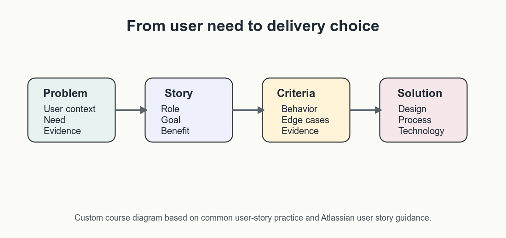
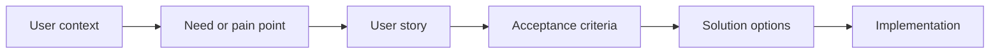

# User Stories Foundations

User stories are short, user-centered descriptions of desired outcomes. They
help product, design, engineering, data, and stakeholder groups discuss what a
person needs before the team commits to how the product should solve it.

[Atlassian's guide to user stories](https://www.atlassian.com/agile/project-management/user-stories)
frames them as lightweight descriptions from the user's perspective, while the
[Agile Alliance glossary](https://agilealliance.org/glossary/user-stories/)
emphasizes the conversations they create between people who need, define, and
build the work.

The common format is:

```text
As a <user or stakeholder>,
I want <goal or capability>,
so that <benefit or reason>.
```

The format is useful because it forces three different questions into the same
sentence:

- **Who** is affected?
- **What** do they need to accomplish?
- **Why** does that matter?

In AI product work, this structure matters because teams can easily jump to
models, prompts, automations, or dashboards before they understand the user
problem. A good user story slows that jump down just enough for a better
conversation.



_Custom course diagram based on Atlassian's user story guidance and common
agile product practice._

## Problem Space and Solution Space

User stories belong first in the problem space. They describe needs, goals,
pain points, decisions, risks, and desired outcomes. They should not start as
technical implementation instructions.

This is why the source material describes stories as a way to keep work tied
to user value rather than as a detailed requirements document.



The problem space asks:

- What user or stakeholder situation are we trying to improve?
- What outcome would create value?
- What risk, friction, delay, or uncertainty exists today?
- What evidence tells us this problem is real?

The solution space asks:

- What design, process, data, or technical options could address the need?
- What can be tested quickly?
- What constraints limit the solution?
- What trade-offs should stakeholders understand?

For AI products, the same user story might be solved by a workflow change, a
better search interface, a rules-based assistant, a retrieval system, or a
human review queue. Starting with the story keeps those options open.

## What Makes a Story Useful

A useful story is not a miniature specification. It is a conversation starter
that helps the team align on value before writing detailed tasks.

This distinction matters: the Agile Alliance describes user stories as
conversation-oriented artifacts, while detailed requirements and implementation
tasks can be added later when the team has enough shared understanding.

| Weak pattern | Better pattern |
|---|---|
| As a user, I want AI. | As a support agent, I want suggested policy passages so that I can answer customer questions faster without guessing. |
| As an admin, I want a database field. | As an operations manager, I want each escalation tagged by reason so that recurring process gaps can be reviewed weekly. |
| Build a dashboard. | As a product lead, I want to see unresolved safety-review cases by severity so that I can decide which launch risks need escalation. |

The better stories name a real role, a user-facing or decision-facing goal, and
a reason that can be discussed.

## User Stories in AI Product Work

AI product stories often involve more than one affected group. A recommender,
assistant, workflow automation, or risk classifier can serve one user while
also affecting reviewers, operations teams, legal teams, and end customers.

The original session's emphasis on problem space versus solution space is
especially important here because AI features can create downstream operational
and governance work even when the visible interface looks small.

When writing stories, consider:

- **Primary user:** Who directly uses or receives the feature?
- **Decision owner:** Who decides whether the feature is acceptable?
- **Reviewer or operator:** Who monitors quality, exceptions, or risk?
- **Affected stakeholder:** Who is impacted even if they do not use the
  interface?

Example:

```text
As a claims reviewer,
I want the assistant to show the policy clause behind each recommendation,
so that I can verify the answer before sending it to a customer.
```

This story is not only about faster work. It also points to traceability,
reviewability, and accountability.

## Common Failure Modes

Teams often struggle with user stories when the story hides too much important
context.

| Failure mode | Symptom | Repair move |
|---|---|---|
| Generic role | "As a user" appears everywhere. | Name the actual user or stakeholder. |
| Solution-first story | The story describes a button, database field, or model before the need. | Rewrite the goal and benefit first. |
| Missing value | The story says what to build but not why it matters. | Add a measurable or observable benefit. |
| Oversized story | The story cannot fit into a sprint or review cycle. | Split by workflow step, user role, or outcome. |
| Hidden risk | AI quality, privacy, permissions, or human review is missing. | Add acceptance criteria or a separate risk story. |

## Check Your Understanding

1. Why should a user story usually describe a problem before a solution?
2. What is weak about the story "As a user, I want an AI chatbot"?
3. Why might an AI product story need to mention reviewers or operators?

<details>
<summary>Show solution</summary>

1. It keeps the team focused on user value and leaves room to compare several
   solution options.
2. It names no specific role, goal, or benefit, and it starts with a solution.
3. AI systems often need monitoring, review, escalation, or governance, so the
   people responsible for those tasks are also part of the product workflow.

</details>

## References & Further Reading

- [Atlassian: User stories with examples and a template](https://www.atlassian.com/agile/project-management/user-stories)
- [Agile Alliance: User Stories](https://agilealliance.org/glossary/user-stories/)
