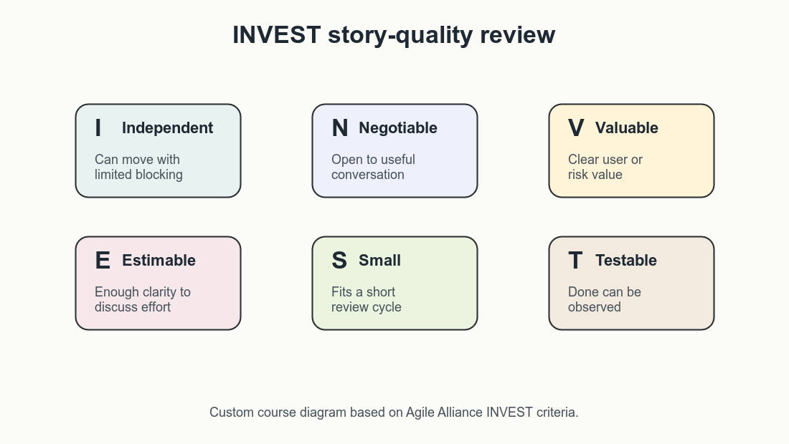
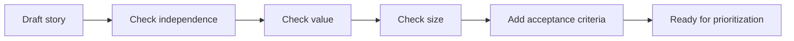

# INVEST and Acceptance Criteria

Once a user story exists, the next task is to test whether it is workable.
INVEST criteria help teams review story quality before the story enters
delivery planning. The acronym comes from the
[Agile Alliance INVEST glossary entry](https://agilealliance.org/glossary/invest/),
which presents it as a practical set of qualities for strong user stories.

INVEST stands for:

| Letter | Meaning | Question to ask |
|---|---|---|
| I | Independent | Can this story move without being tightly blocked by another story? |
| N | Negotiable | Is there room for discussion, or is it pretending to be a fixed specification? |
| V | Valuable | Does it create value for a user, stakeholder, or risk owner? |
| E | Estimable | Is it clear enough for the team to discuss effort and uncertainty? |
| S | Small | Can it fit into a short delivery or review cycle? |
| T | Testable | Can the team tell whether it is done? |

INVEST is a checklist, not a law. Some stories depend on each other. Some
discovery stories are difficult to estimate. The point is to reveal where a
story needs refinement before the team treats it as ready.



_Custom course diagram based on Agile Alliance INVEST criteria._

## Applying INVEST

Use INVEST as a review conversation:



Example draft:

```text
As a support agent,
I want better search,
so that I can answer policy questions.
```

Review:

- **Independent:** Too broad; could depend on ingestion, search ranking, UI,
  and permissions.
- **Negotiable:** Yes, but vague.
- **Valuable:** Yes, if policy-answer speed or accuracy improves.
- **Estimable:** Not yet.
- **Small:** Too large.
- **Testable:** Not yet.

Improved story:

```text
As a support agent,
I want search results to show the policy title, section, and last-updated date,
so that I can choose a trustworthy source before answering a customer.
```

This story is smaller, easier to discuss, and more testable.

## Acceptance Criteria

Acceptance criteria define the observable conditions that must be true before a
story is considered complete. They do not need to describe every implementation
detail. They should make the expected behavior testable. Atlassian's user story
guidance treats acceptance criteria as the companion detail that clarifies when
the story has been satisfied without turning the story itself into a full
technical specification.

Useful acceptance criteria often cover:

- the happy path;
- important edge cases;
- validation and error behavior;
- permissions and user roles;
- data quality or source constraints;
- audit, logging, or review needs;
- non-functional requirements such as latency, reliability, security, or
  accessibility.

Example:

```text
Story:
As a support agent,
I want search results to show the policy title, section, and last-updated date,
so that I can choose a trustworthy source before answering a customer.

Acceptance criteria:
- Each result shows policy title, section heading, and last-updated date.
- Results from retired policy documents are excluded.
- If the date is missing, the result is labeled "date unavailable".
- A support agent can open the referenced policy section from the result.
- The result page loads within the agreed internal performance target.
```

## Writing Testable Criteria

Avoid criteria that rely on vague judgment:

| Vague | More testable |
|---|---|
| The search should be good. | Top results include the matching policy section for the ten agreed pilot questions. |
| The answer should be safe. | The assistant refuses to answer when no approved source is retrieved. |
| The UI should be easy. | A pilot support agent can open the source document from each result without leaving the workflow. |
| The system should be fast. | Search results render within the agreed internal latency target for pilot data. |

For AI products, acceptance criteria should distinguish between model behavior,
product behavior, and human workflow behavior. A criterion like "The answer is
correct" is usually too broad. Ask what evidence, review step, or benchmark
will be used to decide that.

## Prompting an AI Assistant for Story Review

AI tools can help critique stories, but they should not invent stakeholder
evidence. Use them as reviewers, not decision owners. This follows the workshop
principle from the Notion session: AI can challenge wording and completeness,
but validated user evidence still has to come from real stakeholders, product
data, interviews, support signals, or approved business context.

Useful prompt:

```text
Review these user stories using INVEST.

For each story:
- identify unclear roles, goals, or benefits;
- suggest a smaller version if it is too large;
- propose acceptance criteria;
- list assumptions that need human validation.

Do not invent validated user research or business metrics.
```

Record accepted, edited, and rejected AI suggestions in the workshop log.

## Check Your Understanding

1. What does "negotiable" mean in INVEST?
2. Why is "The AI response should be high quality" weak as acceptance criteria?
3. What should a team do if a story is valuable but too large?

<details>
<summary>Show solution</summary>

1. The story is a starting point for discussion, not a fixed contract.
2. It is not directly observable or testable; the team needs evidence,
   examples, review rules, or quality thresholds.
3. Split it into smaller stories by workflow step, user role, risk area, or
   deliverable.

</details>

## References & Further Reading

- [Agile Alliance: INVEST](https://agilealliance.org/glossary/invest/)
- [Atlassian: User stories with examples and a template](https://www.atlassian.com/agile/project-management/user-stories)
