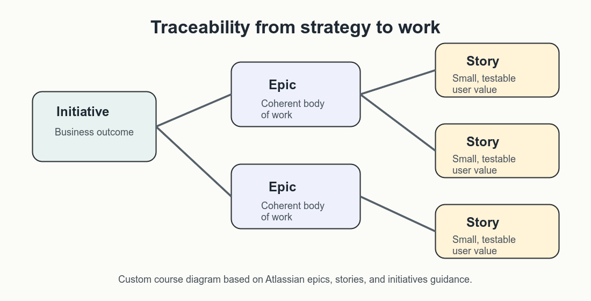
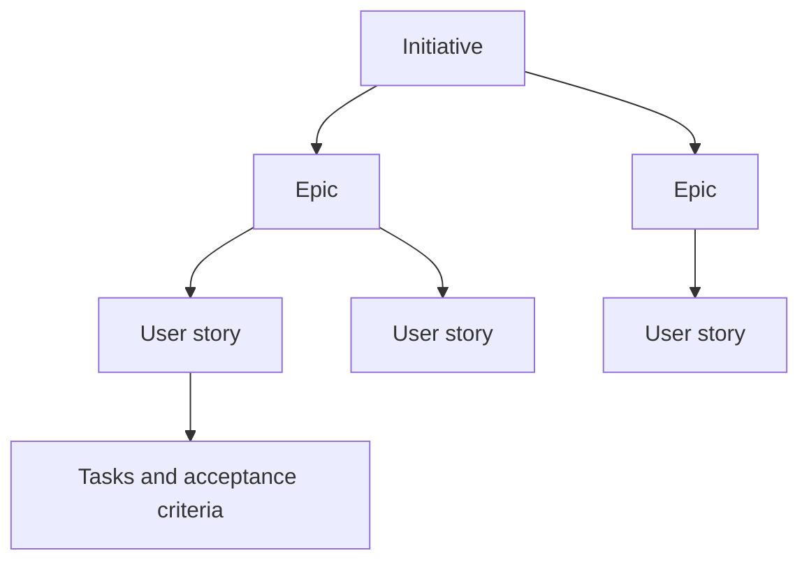

# Epics, Requirements, and Scope

User stories do not exist alone. They usually sit inside a larger structure of
initiatives, epics, deliverables, requirements, and project decisions. Product
managers need to move between those levels without losing traceability.

[Atlassian's hierarchy of epics, stories, and initiatives](https://www.atlassian.com/agile/project-management/epics-stories-themes)
is a useful reference for this relationship: broad objectives become bodies of
work, and those bodies of work are broken into smaller backlog items.

## Initiatives, Epics, and User Stories

An initiative is a broad goal that may span several epics. An epic is a larger
body of work that can be broken down into user stories. A user story is a
smaller, user-centered backlog item that can be discussed, refined, and tested.



_Custom course diagram based on Atlassian's epics, stories, and initiatives
guidance._



Example:

| Level | Example |
|---|---|
| Initiative | Improve internal policy-support workflows. |
| Epic | Let support agents find approved policy sources faster. |
| User story | As a support agent, I want search results to show source title and last-updated date so that I can judge whether the source is trustworthy. |
| Task | Add last-updated metadata to the result card. |

The hierarchy helps teams avoid two opposite problems:

- stories that are too small to connect to business value;
- epics that are too large to plan, discuss, or validate.

## Deliverables and Requirements

Deliverables are tangible outputs produced by a project. Requirements describe
what those outputs must do or what qualities they must have.
The original session separates deliverables, functional requirements, and
non-functional requirements because they answer different management questions:
what will be produced, what behavior is required, and what quality constraints
the work must satisfy.

| Type | Meaning | Example |
|---|---|---|
| Deliverable | A concrete output from the project | Pilot support assistant, source review workflow, launch-readiness brief |
| Functional requirement | What the system or process must do | Users can report an incorrect answer from the result page |
| Non-functional requirement | How well it must work | Feedback submission is available to approved pilot users and is logged for audit |

Functional requirements are often tested by verifying behavior. Non-functional
requirements often need performance, security, accessibility, reliability, or
operational checks.

For AI products, non-functional requirements are not optional polish. This is
also where requirements analysis should connect to governance: source
traceability, human review, privacy, logging, and fallback behavior may decide
whether the product is acceptable at all, not merely whether it is elegant.

Common AI-product non-functional needs include:

- source traceability;
- human review;
- logging and auditability;
- latency;
- privacy and data minimization;
- fallback behavior;
- monitoring and escalation;
- accessibility and usability.

## Requirements Conversation Checklist

When refining a feature or epic, walk through the feature holistically. Not
every item applies every time, but each item can reveal missing assumptions.

| Area | Conversation prompts |
|---|---|
| Happy path | What should happen when everything works as expected? |
| Validation | What user input, data source, or state must be checked? |
| Errors and empty states | What happens when data is missing, invalid, outdated, or unavailable? |
| Technical constraints | Are there performance, platform, vendor, data, or integration limits? |
| Other systems | Does this affect CRM, support, analytics, billing, permissions, or reporting tools? |
| Settings and preferences | Does the feature create or change user-level settings? |
| Other products or features | Could this change break another workflow or expectation? |
| Business rules | Are there thresholds, approval rules, contractual limits, or policy constraints? |
| Permissions and roles | Who can view, edit, approve, override, or audit the feature? |
| Concurrent use | What happens when multiple people edit or act on the same item? |
| Backward compatibility | Does old data, old behavior, or a previous integration still need to work? |
| Notifications | Who needs to be alerted, when, through which channel, and why? |
| Defaults | What should happen before a user configures anything? |

The most important facilitation habit is to ask "why" until the team can
explain the value and risk clearly.

## Scope Boundaries

Stories and epics should also make boundaries visible. Good scope language
helps stakeholders understand what is included, what is excluded, and what
needs later validation.

Example:

```text
In scope:
- Pilot users can search approved policy documents.
- Each result links to the source section.
- Users can flag unclear or incorrect results.

Out of scope for the pilot:
- Generating final customer-facing answers without human review.
- Searching unapproved document sources.
- Automatically changing policy content.
```

This protects the team from accidental scope creep while leaving room for a
future roadmap.

## Check Your Understanding

1. What is the difference between an epic and a user story?
2. Why do AI product stories often need non-functional requirements?
3. What is one risk of skipping explicit scope boundaries?

<details>
<summary>Show solution</summary>

1. An epic is a larger body of work; a user story is a smaller, user-centered
   item that can be refined, tested, and delivered more incrementally.
2. AI products often depend on traceability, review, privacy, fallback,
   monitoring, and operational quality, not only visible features.
3. Stakeholders may assume additional work is included, creating scope creep,
   hidden risk, or unclear delivery expectations.

</details>

## References & Further Reading

- [Atlassian: Epics, stories, and initiatives](https://www.atlassian.com/agile/project-management/epics-stories-themes)
- [Atlassian: Epics](https://www.atlassian.com/agile/project-management/epics)
