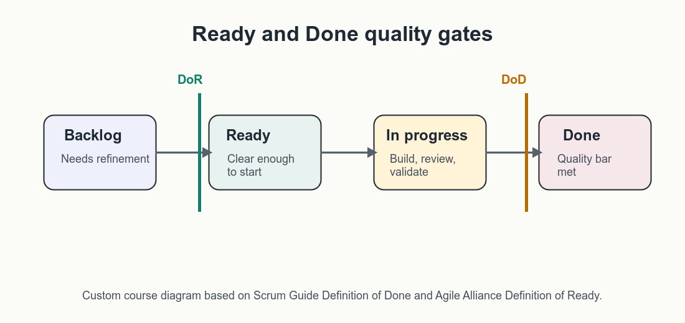
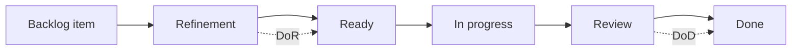

# Ready, Done, and Delivery Quality

User stories need shared entry and exit expectations. Definition of Ready
(DoR) and Definition of Done (DoD) help teams decide when a story is ready to
start and when the work is complete enough to count as done.

The [Scrum Guide](https://scrumguides.org/scrum-guide.html) defines Definition
of Done as a formal quality commitment for the increment. Definition of Ready is
not a Scrum commitment, but the
[Agile Alliance glossary](https://agilealliance.org/glossary/definition-of-ready/)
describes it as a visible set of criteria a story should meet before being
accepted into an upcoming iteration.

_Custom course diagram based on the Scrum Guide's Definition of Done and Agile
Alliance's Definition of Ready glossary._

## Definition of Ready

Definition of Ready is a team agreement about the minimum conditions a backlog
item should meet before the team pulls it into delivery work.

Because DoR is optional, use it as a collaboration aid rather than a rigid
approval gate. The goal is to expose missing context early, not to prevent
learning work from starting.

DoR can include:

- user role, goal, and benefit are clear;
- acceptance criteria are written;
- major dependencies are known;
- the story is small enough for the delivery cycle;
- designs, data, or source materials are available when needed;
- risks, assumptions, and open questions are visible;
- the team has enough context to estimate or size the work.

DoR should not become a bureaucratic gate that blocks useful discovery. Some
items need refinement work precisely because the team does not yet know enough.

## Definition of Done

Definition of Done is a shared standard for completed work. In Scrum, the
Definition of Done describes the state of the increment when it meets the
product's quality measures. In this course, the same idea is adapted beyond
software increments: a Markdown handout, GitHub Project setup, workshop
artifact, or AI-product pilot can also have explicit completion criteria.

DoD can include:

- acceptance criteria are met;
- code, content, configuration, or documentation is reviewed;
- tests or checks pass;
- user-facing copy is reviewed where relevant;
- privacy, security, accessibility, or compliance checks are complete;
- analytics, logging, or monitoring is updated where needed;
- the feature is documented or communicated to affected teams;
- known limitations are recorded.

For AI products, DoD should also reflect the session's emphasis on requirements
conversations: generated behavior, source constraints, review paths, and
operational monitoring must be checked before the team calls the work complete.

AI-specific DoD criteria may include:

- approved data sources are used;
- fallback behavior is tested;
- generated outputs are reviewed against agreed examples;
- human escalation paths work;
- prompt or model changes are documented;
- evaluation results are labeled as pilot, mock, or validated.

## DoR and DoD Compared

| Aspect | Definition of Ready | Definition of Done |
|---|---|---|
| Timing | Before work starts | After work is completed |
| Main question | Can the team start responsibly? | Can the team call this complete? |
| Focus | Clarity, feasibility, dependencies | Quality, validation, release confidence |
| Risk if missing | Rework, blocked work, unclear expectations | Inconsistent quality, hidden defects, false completion |

## Agreeing on Criteria

DoR and DoD should be negotiated with the people who do the work and the people
who rely on the output. Start small, inspect regularly, and revise the criteria
when they stop helping.

Practical facilitation sequence:

1. Ask each person to write criteria they believe are necessary.
2. Group similar criteria.
3. Mark each criterion as **Now**, **Soon**, or **Later**.
4. Agree which criteria are required immediately.
5. Add examples so criteria are not interpreted differently.
6. Revisit the definitions after the next sprint, milestone, or workshop.

## Pitfalls

| Pitfall | What happens | Better move |
|---|---|---|
| Too many criteria | Work slows down and teams ignore the list. | Keep the first version minimal. |
| Passive agreement | People nod but do not use the definitions. | Ask for objections and examples. |
| No revision loop | Criteria become stale as work changes. | Review during retrospectives or project checkpoints. |
| DoR as a wall | Discovery work cannot start because not everything is known. | Separate discovery stories from delivery-ready stories. |
| DoD without evidence | "Done" becomes subjective. | Tie criteria to artifacts, reviews, checks, or demonstrations. |

## Check Your Understanding

1. Why is DoR optional but useful?
2. What is the main difference between DoR and DoD?
3. Why might AI product teams add traceability or fallback behavior to DoD?

Show solution

1. It is a team agreement rather than a required Scrum artifact, but it can
   reduce blocked work and unclear expectations.
2. DoR defines when work is ready to start; DoD defines when completed work
   meets the quality bar.
3. AI products can produce uncertain outputs, depend on source quality, or
   require human review, so completion needs evidence beyond feature behavior.

## References & Further Reading

- [The Scrum Guide: Definition of Done](https://scrumguides.org/scrum-guide.html)
- [Agile Alliance: Definition of Ready](https://agilealliance.org/glossary/definition-of-ready/)
