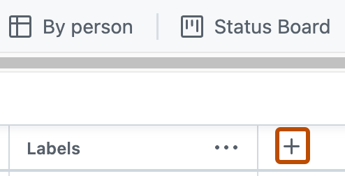

# Session Handout: AI Project Manager Workshop

In this workshop, you act as an AI Project Manager. You start by writing a few
user stories yourself, then you delegate more and more work to Claude Code,
Codex, or a similar coding agent.

The goal is to finish with a GitHub Project, GitHub issues, and a short audit
log. The agent can do the operational work, but you still own the product
judgment.

## Timebox

| Time | Activity | Must finish |
|---|---|---|
| 20 min | Manual PM warm-up | Three user stories with acceptance criteria |
| 25 min | Agent critique | Improved stories and clear assumptions |
| 35 min | GitHub Project setup | Board with core columns and fields |
| 45 min | Agent-operated backlog | Issues created or ready to create with `gh` |
| 25 min | Verification | Checked backlog and short AI collaboration log |
| Bonus | MCP comparison | Explain how connected tools differ from `gh` |

Keep moving. If a phase runs long, reduce scope instead of expanding the
artifact.

## Scenario: Policy Assistant Pilot

Your organization is piloting an internal AI assistant for support agents. The
assistant helps agents find answers in approved policy documents.

Constraints:

- useful pilot within four weeks;
- approved policy documents only;
- source traceability before customer answers;
- legal review for disclaimer wording;
- human review for flagged answers;
- evidence that the pilot saves time without increasing answer risk.

## Must-Have Outputs

By the end, your group should have:

- a GitHub Project named `User Stories Workshop`;
- at least eight backlog issues or approved issue drafts;
- acceptance criteria for the most important stories;
- an `epic-map.md`;
- a short `ready-done-agreements.md`;
- an `ai-collaboration-log.md`.

## Phase 1: Manual PM Warm-Up

Write three user stories manually.

Use:

```text
As a <user or stakeholder>,
I want <goal or capability>,
so that <benefit or risk reduction>.
```

For each story, add:

- two acceptance criteria;
- one open question;
- one risk or assumption.

Do this before using the agent so you can judge whether the agent improves the
work.

## Phase 2: Ask the Agent to Critique

Open the project with Claude Code, Codex, or another coding agent using any
available interface, such as a VS Code extension, CLI, desktop application, or
another graphical interface.

Prompt:

```text
Act as a backlog refinement partner for an AI Project Manager.

Review our three draft user stories.

For each story:
- apply INVEST;
- identify unclear roles, goals, or benefits;
- suggest a smaller or clearer version;
- propose acceptance criteria;
- list assumptions that need human validation.

Do not create GitHub issues yet.
Do not invent user research or business evidence.
```

Accept, edit, or reject the suggestions. Record the decision in
`ai-collaboration-log.md`.

## Phase 3: Create the GitHub Project

Create a GitHub Project named `User Stories Workshop`.

Use the GitHub docs if needed:

- [Quickstart for Projects](https://docs.github.com/en/issues/planning-and-tracking-with-projects/learning-about-projects/quickstart-for-projects)
- [Creating a project](https://docs.github.com/en/issues/planning-and-tracking-with-projects/creating-projects/creating-a-project)
- [Adding items to your project](https://docs.github.com/en/issues/planning-and-tracking-with-projects/managing-items-in-your-project/adding-items-to-your-project)

Open the repository's **Projects** tab.


_Source: GitHub Docs, "Adding your project to a repository"._

Create a board with:

- `Backlog`
- `Ready`
- `In progress`
- `Review`
- `Blocked`
- `Done`

Add only the fields you will actually use:

| Field | Type | Suggested values |
|---|---|---|
| Work type | Single select | Epic, Story, Requirement |
| Story quality | Single select | Draft, Needs refinement, Ready |
| Risk area | Single select | Privacy, Source quality, Human review, Legal, Reliability, None |
| Owner | Assignee | One responsible person |



_Source: GitHub Docs, "Quickstart for Projects"._

## Phase 4: Let the Agent Build the Backlog

Ask the agent to generate the workshop files and issue drafts.

Prompt:

```text
Create the workshop backlog for the Policy Assistant Pilot.

Create or update:
- story-backlog.md
- acceptance-criteria.md
- epic-map.md
- ready-done-agreements.md
- ai-collaboration-log.md

Include at least eight user stories.
Group them into epics.
Add acceptance criteria for each story.
Mark assumptions clearly.

Do not create GitHub issues until I approve.
```

Review the result quickly:

- Roles are specific.
- Benefits are clear.
- Acceptance criteria are testable.
- AI risks are visible.
- Assumptions are marked.
- No fake user research was invented.

## Phase 5: Let the Agent Operate GitHub

Use [06 - Agent-Operated GitHub Workflow](06-agent-operated-github-workflow.md)
for the exact `gh` prompts.

Minimum target:

1. Agent prepares `gh issue create` commands.
2. Group approves them.
3. Agent creates the issues or explains what blocked it.
4. Agent runs `gh issue list --limit 20`.
5. Group verifies that GitHub matches the backlog.

Do not spend the whole afternoon perfecting fields and project automation. A
finished, verified backlog is better than a half-finished sophisticated setup.

## Phase 6: Final Verification

Ask the agent:

```text
Create a short AI Project Manager audit summary.

Include:
- files created or changed;
- GitHub issues created or prepared;
- assumptions that still need validation;
- risks or weak stories to revisit;
- commands or tools used;
- what you refused or deferred until human approval.
```

Then complete `ai-collaboration-log.md`:

| Prompt or request | Accepted | Edited | Rejected | Reason |
|---|---|---|---|---|
|  |  |  |  |  |

## Done Means

You are done when you can show:

- the GitHub Project;
- the issues or approved issue drafts;
- the local backlog files;
- the AI collaboration log;
- one example where you corrected or rejected the agent.

## Bonus: MCP Comparison

If time remains, ask the agent:

```text
Do you have a connected GitHub tool or MCP server available?

If yes, explain one small read-only GitHub action you can perform through it.
If no, explain what setup would be needed and continue using gh.

Compare this with the command-line workflow.
```

The key comparison: `gh` shows explicit shell commands; MCP or connected tools
can be smoother, but still require permission boundaries and human verification.
