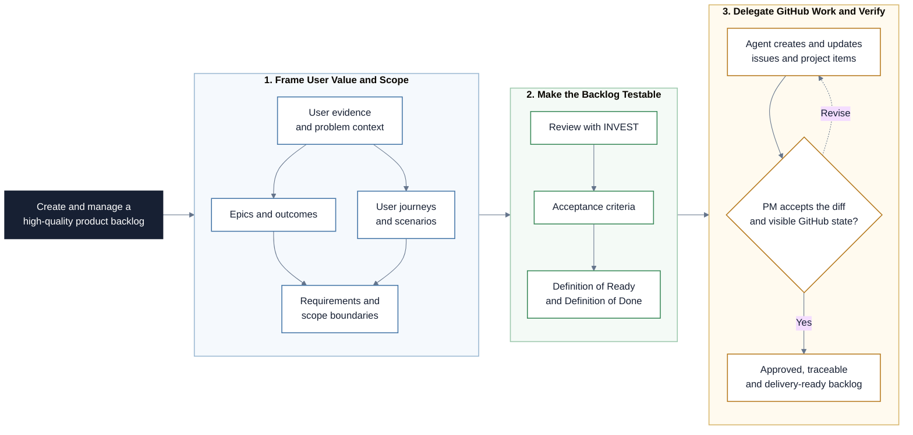

# User Stories and Requirements

This repository is a Markdown-based learning path for writing user stories,
acceptance criteria, epics, requirements, and readiness agreements in AI product
work. Participants learn how to separate problem understanding from solution
design, translate stakeholder needs into small testable backlog items, and use
GitHub Projects to manage refinement work. The session then moves one step
further: participants act as AI Project Managers who delegate backlog operations
to Claude Code, Codex, or a similar coding agent while they stay responsible
for framing, approval, and verification.

## Project at a Glance

The project turns a user problem into a testable backlog, then lets an AI coding
agent operate GitHub while the PM verifies every consequential change.



## Learning Objectives

By the end of this repository, you should be able to:

- Explain how user stories help teams keep work anchored in user value.
- Distinguish problem space discovery from solution space design.
- Write user stories using role, goal, and benefit without prescribing a
  premature implementation.
- Apply INVEST criteria to review and improve backlog items.
- Write acceptance criteria that make a story testable.
- Connect initiatives, epics, user stories, requirements, and deliverables.
- Facilitate requirements conversations that cover happy paths, edge cases,
  integrations, permissions, notifications, and non-functional needs.
- Define lightweight Definition of Ready and Definition of Done agreements.
- Use GitHub Projects and a coding agent to critique, refine, create, and
  update backlog artifacts while retaining human decision ownership.
- Compare manual GitHub work, command-line GitHub operation through `gh`, and
  MCP-style tool-connected operation.
- Practice the AI Project Manager role: describe outcomes, delegate work,
  verify agent actions, and document what was accepted or rejected.

## Learning Path

The modules build on each other in order.

| File / Folder | Description |
|---|---|
| [**01 - User Stories Foundations**](01-user-stories-foundations.md) | Understand user stories, problem space, solution space, and user-centered requirement framing. |
| [**02 - INVEST and Acceptance Criteria**](02-invest-and-acceptance-criteria.md) | Use INVEST criteria and acceptance criteria to make stories negotiable, valuable, small, and testable. |
| [**03 - Epics, Requirements, and Scope**](03-epics-requirements-and-scope.md) | Connect initiatives, epics, user stories, deliverables, and functional and non-functional requirements. |
| [**04 - Ready, Done, and Delivery Quality**](04-ready-done-and-delivery-quality.md) | Define practical DoR and DoD agreements that support planning, quality, and shared expectations. |
| [**05 - Session Handout**](05-session-handout.md) | Run the practical workshop from manual PM work toward agent-assisted backlog refinement. |
| [**06 - Agent-Operated GitHub Workflow**](06-agent-operated-github-workflow.md) | Let Claude Code or Codex operate GitHub through the command line, then compare that with MCP-style connected tooling. |

### Additional Folders and Files

| File / Folder | Description |
|---|---|
| [**assets**](assets/) | Local concept diagrams and GitHub Projects screenshots used across the modules and workshop handout. |

## Setup

> [!NOTE]
> Throughout these steps, text in angle brackets like `<repo-name>` is a
> placeholder. Replace it including the `< >` brackets with your own value.
> For example, `cd <repo-name>` becomes `cd aipm-user-stories`.

### 1. Create the Repository from the Template

Click **Use this template** on GitHub.

When creating the repository:

- Set yourself as the **Owner**
- Choose a repository name
- Disable **Include all branches**
- Click **Create repository**

> [!IMPORTANT]
> If you are working in pairs or groups, only one person should complete this
> step.

---

### 2. Add Collaborators (Pairs/Groups Only)

If working with teammates:

1. Open the repository on GitHub
2. Go to **Settings -> Collaborators**
3. Add your teammates as collaborators
4. Share the repository link with your team

Teammates should accept the invitation before continuing.

---

### 3. Clone the Repository

Copy the SSH URL from the **Code** button on GitHub, then run:

```bash
git clone <copied-ssh-url>
```

The copied SSH URL will look like:
`git@github.com:<your-username>/<repo-name>.git`.

---

### 4. Move into the Project Folder

No Python environment is required for this repository.

```bash
cd <repo-name>
```

---

### 5. Open the Lesson Files

Open `README.md` and follow the lesson files in numerical order. The files are
plain Markdown and can be read directly on GitHub or in a local editor.

## References & Further Reading

- [**Atlassian: User stories with examples and a template**](https://www.atlassian.com/agile/project-management/user-stories):
  Practical overview of user stories as concise, user-focused descriptions of
  desired outcomes.
- [**Agile Alliance: INVEST**](https://agilealliance.org/glossary/invest/):
  Definition of INVEST as criteria for assessing the quality of user stories.
- [**Atlassian: Epics, stories, and initiatives**](https://www.atlassian.com/agile/project-management/epics-stories-themes):
  Overview of hierarchy from large objectives to actionable backlog items.
- [**The Scrum Guide: Definition of Done**](https://scrumguides.org/scrum-guide.html):
  Authoritative Scrum reference for Definition of Done.
- [**Agile Alliance: Definition of Ready**](https://agilealliance.org/glossary/definition-of-ready/):
  Practical glossary entry for readiness criteria before iteration work begins.
- [**GitHub Docs: Quickstart for Projects**](https://docs.github.com/en/issues/planning-and-tracking-with-projects/learning-about-projects/quickstart-for-projects):
  Official guide for setting up and using GitHub Projects.
- [**GitHub CLI: `gh issue create`**](https://cli.github.com/manual/gh_issue_create):
  Command-line reference for creating issues and adding them to projects.
- [**GitHub CLI: `gh project`**](https://cli.github.com/manual/gh_project):
  Command-line reference for GitHub Projects operations.
- [**Claude Code: Connect tools with MCP**](https://docs.anthropic.com/en/docs/claude-code/mcp):
  Anthropic documentation for connecting Claude Code to external tools through
  Model Context Protocol.
- [**Claude Code: Skills**](https://docs.anthropic.com/en/docs/claude-code/skills):
  Anthropic documentation for reusable Claude Code instructions.
- [**Codex: GitHub integration**](https://developers.openai.com/codex/integrations/github):
  OpenAI documentation for Codex GitHub review workflows.
