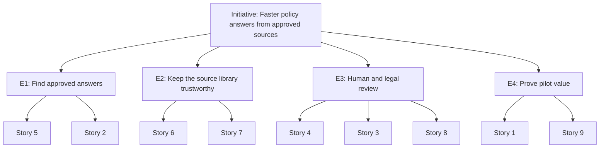

# Epic Map: Policy Assistant Pilot

## Initiative

Help support agents answer policy questions faster from approved sources, without increasing answer risk.

## Epics and Stories

| Epic | Outcome | Stories | Scenario constraint covered |
|---|---|---|---|
| **E1: Find approved answers** | Support agents find the right approved policy passage and can verify it before answering. | Story 5: Ask a policy question Story 2: Source confirmation | Approved documents only; source traceability before customer answers |
| **E2: Keep the source library trustworthy** | Only approved, current policy documents can be used by the assistant. | Story 6: Keep the source library approved Story 7: Retire outdated policy documents | Approved documents only |
| **E3: Human and legal review** | Risky answers and legal wording are checked by people before they reach customers. | Story 4: Flag an uncertain answer Story 3: Review flagged answers Story 8: Approve disclaimer wording | Human review for flagged answers; legal review for disclaimer wording |
| **E4: Prove pilot value** | The team can show whether the pilot saves time without increasing answer risk. | Story 1: Service speed analysis Story 9: Track answer risk during the pilot | Evidence that the pilot saves time without increasing answer risk |

## Dependencies

- Story 3 depends on Story 4: reviewers can only review answers that agents can flag.
- Story 2 depends on Story 6: the "approved" status must exist before it can be shown.
- Story 9 depends on Stories 3 and 4: flagged and corrected answers must be recorded.
- Story 8 must be done before any suggested answer is shown to support agents.

## Scope Boundaries

**In scope for the pilot:**
- Support agents ask policy questions and receive suggested passages from approved documents.
- Each suggestion shows its source document.
- Support agents can flag answers; reviewers confirm or correct them.
- Legal reviewers approve disclaimer wording.
- The pilot owner sees time and answer-risk evidence.

**Out of scope for the pilot:**
- Sending answers to customers without a support agent.
- Searching unapproved or external sources.
- Automatically changing policy content.

## Assumptions to Validate

These are assumptions, not validated facts. None of them is based on user research.

- Handling time is recorded today, and baseline data from before the assistant exists (Story 1).
- An approval process for policy documents exists outside the assistant (Story 6).
- A reviewer is available during support hours (Story 3).
- The legal team can review the disclaimer before the pilot starts (Story 8).
- Support agents flag uncertain answers consistently (Stories 4 and 9).
